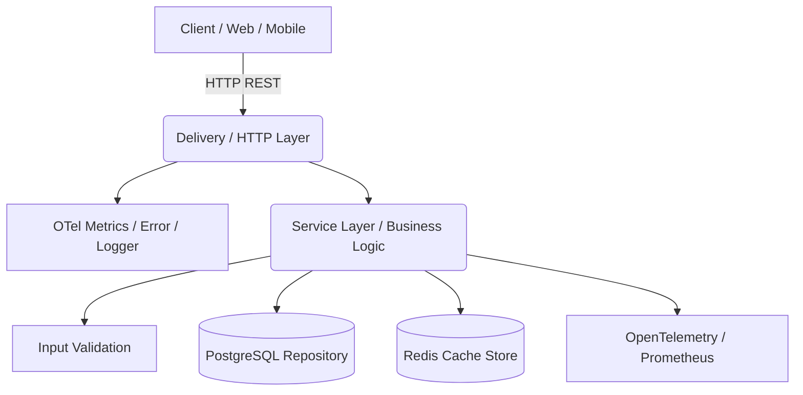

# Architecture

## Overview

The project follows **Clean Architecture** to separate concerns:



## Project Structure

```
.
├── cmd/                    # Application entry point (main.go)
├── adapter/                # External service adapters
│   └── appmetrics/         # OTel metrics implementation
├── delivery/               # HTTP layer
│   └── httpserver/
│       ├── server.go       # Gin server setup
│       ├── taskhandler/    # Request handlers
│       └── middleware/      # Error handler, metrics, logger
├── entity/                 # Core domain models
├── param/                  # Request/response DTOs
├── repository/             # Data access layer
│   ├── postgres/           # PostgreSQL implementation
│   ├── redis/              # Redis cache implementation
│   └── migrations/         # SQL migration files (embedded)
├── service/                # Business logic
├── validation/             # Input validation rules
├── pkg/                    # Shared utilities
│   ├── config/             # Configuration loader
│   ├── logger/             # Structured logging (slog)
│   ├── metric/             # OTel metrics setup
│   ├── trace/              # OTel tracing setup
│   ├── richerror/          # Typed error handling
│   ├── mapper/             # Error → HTTP status mapping
│   ├── postgresdb/         # PostgreSQL connection pool
│   ├── redis/              # Redis client setup
│   └── migration/          # SQL migration runner
├── docs/                   # Swagger/OpenAPI specs
├── deploy/                 # Prometheus config
├── config.yml              # Application configuration
├── Dockerfile              # Multi-stage Docker build
├── docker-compose.yml      # Infrastructure orchestration
└── Makefile                # Build automation
```

## Architectural Decisions

### 1. Optimistic Locking vs Pessimistic Locking

**Decision:** Optimistic Locking via `version` field.

**Trade-off:** Pessimistic locking locks rows at the DB level, degrading performance under concurrency. Since tasks are rarely updated by multiple users simultaneously, optimistic locking provides better performance while protecting data integrity. The version mismatch returns 409 Conflict.

### 2. OpenTelemetry vs Native Prometheus Client

**Decision:** OpenTelemetry SDK with Prometheus exporter.

**Trade-off:** Adds abstraction but avoids vendor lock-in. Switching from Prometheus to Datadog/Jaeger requires only config change, not code changes.

### 3. Cache-Aside Pattern with Redis

**Decision:** Read-first from Redis cache; write-through invalidation on updates/deletes.

**Trade-off:** Adds complexity to write path (DeleteByPrefix on Create/Update/Delete). However, significantly reduces PostgreSQL load for frequent reads. TTL mitigates long-term staleness.

### 4. Soft Delete vs Hard Delete

**Decision:** Soft delete via `deleted_at` column.

**Trade-off:** Queries need `WHERE deleted_at IS NULL` on every read. However, preserves data for audit trails and enables accidental deletion recovery.

### 5. Docker: Alpine vs Scratch

**Decision:** `alpine:3.19` for final image.

**Trade-off:** `scratch` would be ~5MB smaller, but `alpine` includes `tzdata` (time zones), `ca-certificates` (TLS), and a shell for debugging — critical for production.

### 6. Auto-Migration on Boot

**Decision:** Embedded SQL migrations run automatically via `migrator.Up()`.

**Trade-off:** In large-scale microservices with hundreds of replicas, auto-migration can cause DB locks. However, for this scale, it improves DX and enables plug-and-play deployment.

### 7. Error Handling: RichError Pattern

**Decision:** Typed errors (`KindNotFound`, `KindConflict`, etc.) mapped to HTTP status codes via `mapper.MapToStatusCode`.

**Trade-off:** More verbose than simple `error` returns, but provides consistent API responses, proper HTTP status codes, and structured error metadata without exposing internal details.

### 8. Database Indexing Strategy (Single vs Composite)
* **Decision:** Used single partial indexes (`status`, `assignee`, `created_at`) with `WHERE deleted_at IS NULL` instead of a large composite index.
* **Trade-off:** A composite index like `(status, assignee)` would be slightly faster for queries containing *both* filters. However, due to the B-Tree Left-Prefix Rule, it would be useless if the user filters *only* by `assignee`. Single indexes provide maximum flexibility for optional REST API filters, allowing PostgreSQL to use `BitmapAnd` index scans efficiently without the write-penalty of redundant indexes.

### 9. Omission of Authentication & Authorization
* **Decision:** Authentication (e.g., JWT validation) was intentionally omitted from this service.
* **Trade-off:** Implementing auth locally within the Task Service would violate the Single Responsibility Principle (SRP) in a microservices architecture. Since the prompt explicitly scopes this as a "Task Microservice", the architectural assumption is that authentication is offloaded to an upstream **API Gateway** or a dedicated **Identity Microservice**. The gateway would verify the token and forward the request to this service with injected identity headers (e.g., `X-User-ID`). This keeps the Task Service strictly focused on its core domain.

## Data Flow

```
Request → Middleware(ErrorHandler, Metrics, Logger)
       → Handler(Validate, Parse, Call Service)
       → Service(Business Logic)
         → Repository(Create/Get/Update/Delete)
           → PostgreSQL (with optimistic locking)
         → CacheStore(Set/Get/Delete)
           → Redis (cache-aside pattern)
       → Response (Envelope format)
```

## Cache Strategy

| Operation | Cache Action |
|-----------|-------------|
| CreateTask | `Set` (cache new task) + `DeleteByPrefix("tasks:list:")` |
| GetTask | `Get` (check cache first, fallback to DB) |
| UpdateTask | `Delete` (invalidate single task) + `DeleteByPrefix("tasks:list:")` |
| DeleteTask | `Delete` (invalidate single task) + `DeleteByPrefix("tasks:list:")` |
| ListTasks | `Get` (check cache first, fallback to DB + Set) |
