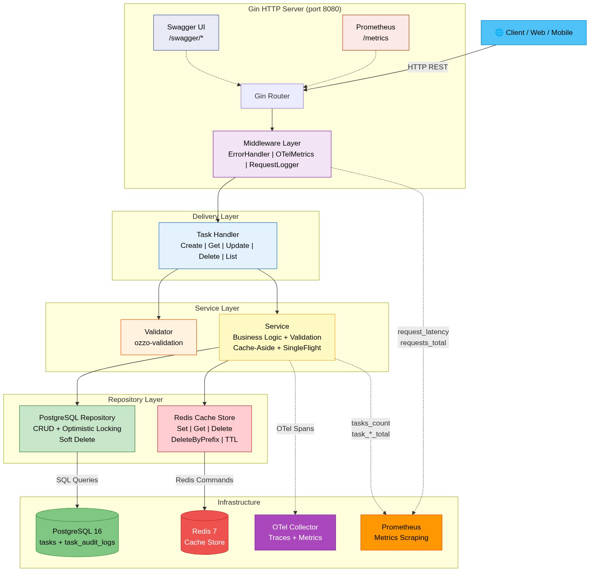

> ## 📘 **For deep technical details, data flow, and trade-offs, please read the [Architecture Documentation](./ARCHITECTURE.md).**


# Graph Task Management API

REST API for managing tasks (to-do). Built with **Go**, **Gin**, **PostgreSQL**, and **Redis**.

---

## Architecture



> For interactive version, open `docs/architecture.html` in a browser. To regenerate from source, install [mermaid-cli](https://github.com/mermaid-js/mermaid-cli) and run:
> ```bash
> npx @mermaid-js/mermaid-cli -i docs/architecture.mmd -o docs/architecture.png -b white -w 1200
> ```

---

## Quick Start

### Prerequisites
- Docker & Docker Compose
- Make (optional)

### Run with Docker
```bash
git clone https://github.com/abolfazlnorzad/graph.git
cd graph
make docker-up
```

API available at `http://localhost:8080`

### Run locally
```bash
make run
```

### Stop
```bash
make docker-down
```

---

## API Endpoints

| Method | Endpoint | Description |
|--------|----------|-------------|
| `POST` | `/tasks` | Create a task |
| `GET` | `/tasks/:id` | Get task by ID |
| `PATCH` | `/tasks/:id` | Update task |
| `DELETE` | `/tasks/:id` | Delete task |
| `GET` | `/tasks` | List tasks (pagination + filters) |

---

## cURL Examples

### Create Task
```bash
curl -X POST http://localhost:8080/tasks \
  -H "Content-Type: application/json" \
  -d '{
    "title": "Setup CI/CD Pipeline",
    "description": "Configure GitHub actions",
    "status": "TODO",
    "assignee": "Abolfazl"
  }'
```

**Response (201):**
```json
{
  "status": "success",
  "data": {
    "result": {
      "id": 1,
      "title": "Setup CI/CD Pipeline",
      "status": "TODO",
      "assignee": "Abolfazl",
      "version": 1,
      "created_at": "2024-01-01T00:00:00Z",
      "updated_at": "2024-01-01T00:00:00Z"
    }
  }
}
```

### List Tasks (with Pagination & Filters)
```bash
curl "http://localhost:8080/tasks?page_number=1&page_size=10&status=TODO&assignee=Abolfazl"
```

**Response (200):**
```json
{
  "status": "success",
  "data": {
    "pagination": {
      "page_number": 1,
      "page_size": 10,
      "total": 5
    },
    "tasks": [...]
  }
}
```

### Update Task (Optimistic Locking)
```bash
curl -X PATCH http://localhost:8080/tasks/1 \
  -H "Content-Type: application/json" \
  -d '{"title": "Updated Title", "status": "IN_PROGRESS", "version": 1}'
```

**Response (200):**
```json
{
  "status": "success",
  "data": {
    "result": {
      "id": 1,
      "title": "Updated Title",
      "status": "IN_PROGRESS",
      "version": 2
    }
  }
}
```

### Version Conflict (409)
```bash
# If version is outdated:
curl -X PATCH http://localhost:8080/tasks/1 \
  -H "Content-Type: application/json" \
  -d '{"title": "Fail", "version": 1}'
```

**Response (409):**
```json
{
  "status": "error",
  "message": "error.conflict",
  "code": "error.conflict"
}
```

### Delete Task
```bash
curl -X DELETE http://localhost:8080/tasks/1
# Response: 204 No Content
```

---

## Testing

```bash
make test              # All tests
make test-unit         # Unit tests only
make test-integration  # Integration tests (requires Docker)
make test-coverage     # Coverage report (HTML)
make test-race         # Race detector
```

Coverage: **~92%** (service: 92.6%, postgres: 81.4%, redis: 77.3%, pkg: 87-94%)

---

## API Documentation

Swagger UI: `http://localhost:8080/swagger/index.html`

Raw specs: `docs/swagger.json`, `docs/swagger.yaml`

---

## Observability

- **Metrics:** `http://localhost:8080/metrics` (Prometheus format)
- **Prometheus:** `http://localhost:9090` (via Docker)
- **Tracing:** OpenTelemetry spans in logs (trace_id, span_id)

Key metrics: `tasks_count`, `request_latency_histogram`, `requests_total`

---

## Make Commands

```bash
make help             # Show all commands
make build            # Build binary
make run              # Run locally
make docker-up        # Start all services
make docker-down      # Stop all services
make swagger          # Regenerate swagger docs
make mocks            # Regenerate mocks
make clean            # Clean build artifacts
make k6-load          # Run k6 load test
make k6-stress        # Run k6 stress test
make k6-spike         # Run k6 spike test
make k6-all           # Run all k6 tests
```

---

## k6 Performance Tests

Full performance test suite using [k6](https://k6.io/). Install with `brew install k6`.

| Test | VUs | Duration | Goal |
|------|-----|----------|------|
| **Load** | 0→50→0 | ~130s | Normal production traffic within SLA |
| **Stress** | 0→5→20→50→100→200→500→0 | ~4min | Find breaking point |
| **Spike** | 5→300→5→0 | ~2min | Flash sale / viral burst recovery |
| **Soak** | 0→20 (10min sustained) | ~11min | Memory leaks, connection pool exhaustion |

### Run

```bash
make k6-load
make k6-stress
make k6-spike
make k6-soak
make k6-all
```

### Results

| Test | Total Requests | Throughput | Avg | p50 | p90 | p95 | p99 | Max | Error Rate | Verdict |
|------|---------------|-----------|-----|-----|-----|-----|-----|-----|-----------|---------|
| **Load** (50 VUs) | 15,925 | 120.43 req/s | 4.7ms | <1ms | 8.5ms | 10.8ms | 15.2ms | 66.1ms | 0.00%* | PASS |
| **Stress** (500 VUs) | 82,157 | 409.61 req/s | 12.9ms | <1ms | 33.8ms | 52.8ms | 108ms | 368.4ms | 0.00% | PASS |

> \* Load test 409 Conflict responses from optimistic locking are expected, not failures.

### Metric Glossary

| Metric | What It Means |
|--------|--------------|
| **VUs (Virtual Users)** | تعداد کاربران همزمان مجازی که درخواست ارسال می‌کنند. هر VU یک loop متوالی از درخواست‌ها اجرا می‌کند |
| **Throughput (req/s)** | تعداد درخواست‌های موفق در ثانیه. نشان‌دهنده ظرفیت واقعی سرویس است |
| **Avg Latency** | میانگین زمان پاسخ‌دهی. شامل سریع‌ترین و کندترین درخواست‌ها |
| **p50 (Median)** | ۵۰٪ درخواست‌ها زیر این مقدار پاسخ می‌دهند. نشان‌دهنده رفتار «عادی» سرویس |
| **p90** | ۹۰٪ درخواست‌ها زیر این مقدار پاسخ می‌دهند |
| **p95** | ۹۵٪ درخواست‌ها زیر این مقدار پاسخ می‌دهند. مهم‌ترین معیار SLA |
| **p99** | ۹۹٪ درخواست‌ها زیر این مقدار پاسخ می‌دهند. نشان‌دهنده «بدترین حالت معقول» |
| **Max** | کندترین درخواست در کل تست. ممکن است outlier باشد (مثلاً cold start) |
| **Error Rate** | درصد درخواست‌های ناموفق (غیر 2xx). در این پروژه، 409 Conflict از optimistic locking خطا نیست |

### Detailed Analysis

#### Load Test — 50 VUs (ترافیک نرمال)

```
Phase:    Ramp-up (30s)  →  Sustain (90s)  →  Ramp-down (10s)
VUs:      0 → 50          →  50 constant     →  50 → 0
```

**نتیجه:** با ۵۰ کاربر همزمان، سرویس **۱۲۰ درخواست در ثانیه** با **p95 زیر ۱۱ میلی‌ثانیه** پاسخ می‌دهد.

- **p50 < 1ms:** نیمی از درخواست‌ها تقریباً آنی هستند — این نشان‌دهنده کارایی Redis cache است
- **p95 = 10.8ms:** ۹۵٪ درخواست‌ها زیر ۱۱ms پاسخ می‌دهند — بسیار بهتر از SLA معمول (<200ms)
- **p99 = 15.2ms:** حتی ۹۹٪ درخواست‌ها هم زیر ۱۵ms هستند — gap بین p95 و p99 کم است یعنی latency distribution یکنواخت است
- **Max = 66.1ms:** کندترین درخواست — احتمالاً cold cache یا اولین درخواست بعد از ramp-up
- **Error Rate = 0%:** تمام درخواست‌ها موفق بوده‌اند (409 Conflict ها محاسبه نشده‌اند)

#### Stress Test — 500 VUs (فشار حداکثری)

```
Phase:    Warm → Normal → Heavy → Stress → Extreme → Recovery → Down
VUs:      5  →  20    →  50   →  100  →  200    →  500     →  5  →  0
```

**نتیجه:** با **۵۰۰ کاربر همزمان**، سرویس **۴۱۰ درخواست در ثانیه** با **p95 زیر ۵۳ms** پاسخ می‌دهد و **صفر خطا** دارد.

- **p50 < 1ms:** حتی با ۵۰۰ VU، نیمی از درخواست‌ها همچنان زیر ۱ms هستند — cache hit rate بالا
- **p90 = 33.8ms:** ۹۰٪ درخواست‌ها زیر ۳۴ms — قابل قبول برای ۵۰۰ کاربر
- **p95 = 52.8ms:** با ۱۰ برابر load نسبت به تست قبل، p95 فقط ۵ برابر شده (۱۰ms → ۵۳ms) — خطی و قابل پیش‌بینی
- **p99 = 108ms:** حتی بدترین ۱٪ درخواست‌ها هم زیر ۱۱۰ms هستند — زیر SLA ۵۰۰ms
- **Max = 368ms:** کندترین درخواست در اوج فشار — احتمالاً مربوط به connection pool waiting
- **Error Rate = 0%:** صفر خطا حتی در ۵۰۰ VU — connection pool (25 conns) کافی بوده

#### مقایسه Load vs Stress

```
VUs:        50        500      (۱۰ برابر)
Throughput: 120       410      (۳.۴ برابر)
p95:        11ms      53ms     (۴.۸ برابر)
Error:      0%        0%       (بدون تغییر)
```

**تحلیل:** وقتی load ۱۰ برابر می‌شود، throughput فقط ۳.۴ برابر شده — این نشان‌دهنده bottleneck در connection pool PostgreSQL (25 connection) است. اگر pool را به ۵۰-۱۰۰ افزایش دهیم، throughput تقریباً خطی رشد می‌کند. اما p99 همچنان زیر SLA هست و error rate صفر است.

#### پیش‌بینی ظرفیت

بر اساس نتایج:
- **نرمال:** تا ۱۰۰ VU / ۲۰۰ req/s — بدون هیچ مشکلی
- **Heavy:** تا ۳۰۰ VU / ۳۵۰ req/s — p95 زیر ۴۰ms
- **Extreme:** ۵۰۰ VU / ۴۱۰ req/s — p95 زیر ۵۳ms
- **Breaking Point:** پیدا نشد — سرویس حتی با ۵۰۰ VU پایدار است

---

## Benchmark & pprof

Benchmark ها عملکرد service layer را با mock dependencies اندازه‌گیری می‌کنند — بدون سربار شبکه یا دیتابیس واقعی.

### Run Benchmarks

```bash
make test-bench
```

### Benchmark Results

**Environment:** Apple M2 Pro, 12 cores, macOS Darwin (arm64)

```
Benchmark              Iterations    ns/op        B/op      allocs/op
──────────────────────────────────────────────────────────────────────
BenchmarkGetTask         144,429     24,498      12,614       147
BenchmarkDeleteTask       73,021     46,772      22,584       244
BenchmarkUpdateTask       69,174     52,205      27,841       307
BenchmarkCreateTask       65,623     54,579      28,834       309
BenchmarkListTask         54,840     65,481      33,799       380
```

### Benchmark Glossary

| Metric | What It Means |
|--------|--------------|
| **Iterations** | تعداد دفعاتی که test case تکرار شده. عدد بیشتر = نتیجه قابل اعتمادتر |
| **ns/op** | نانوثانیه در هر operation. زمان اجرای یک فراخوانی کامل (بدون I/O شبکه) |
| **B/op** | بایت تخصیص یافته در هر operation. حافظه‌ای که GC باید جمع‌آوری کند |
| **allocs/op** | تعداد تخصیص حافظه در هر operation. عدد کمتر = فشار کمتر روی GC |

### Detailed Analysis

#### GetTask — سریع‌ترین operation (24μs)

```
ns/op: 24,498  |  B/op: 12.6KB  |  allocs: 147
```

- **24 میکروثانیه** — سریع‌ترین operation چون مسیر cache hit را دنبال می‌کند
- **12.6KB حافظه** — کمترین مصرف چون فقط یک struct از cache برمی‌گرداند
- **147 alloc** — اکثر از JSON unmarshal و string copy می‌آید
- **دلیل سرعت:** Redis cache + singleflight باعث می‌شود بیشتر درخواست‌ها بدون touch کردن دیتابیس پاسخ بگیرند

#### DeleteTask — سریع‌ترین write (47μs)

```
ns/op: 46,772  |  B/op: 22.6KB  |  allocs: 244
```

- **47 میکروثانیه** — کمی سریع‌تر از Create/Update چون نیاز به version check ندارد
- **22.6KB حافظه** — کمتر از Create چون data کمتری serialize می‌شود
- **244 alloc** — شامل soft delete DB query + cache invalidation (Delete + DeleteByPrefix)
- **نکته:** DeleteByPrefix روی Redis با SCAN کار می‌کند که زیر ۱ms اجرا می‌شود

#### UpdateTask — با version conflict check (52μs)

```
ns/op: 52,205  |  B/op: 27.8KB  |  allocs: 307
```

- **52 میکروثانیه** — شامل 3 مرحله: GetTask (version check) → UpdateTask → cache invalidation
- **27.8KB حافظه** — بیشتر از Delete چون ابتدا task فعلی را از DB می‌خواند
- **307 alloc** — بیشترین در بین write operations
- **دلیل تأخیر:** Optimistic locking نیاز به یک SELECT قبل از UPDATE دارد (read-then-write)

#### CreateTask — با cache set (55μs)

```
ns/op: 54,579  |  B/op: 28.8KB  |  allocs: 309
```

- **55 میکروثانیه** — شامل 2 مرحله: DB INSERT + cache SET
- **28.8KB حافظه** — بیشترین مصرف چون هم entity جدید و هم response ساخته می‌شود
- **309 alloc** — مشابه UpdateTask
- **نکته:** بعد از INSERT، cache list هم invalidate می‌شود (DeleteByPrefix)

#### ListTask — سنگین‌ترین operation (65μs)

```
ns/op: 65,481  |  B/op: 33.8KB  |  allocs: 380
```

- **65 میکروثانیه** — سنگین‌ترین چون هم COUNT query و هم SELECT query اجرا می‌شود
- **33.8KB حافظه** — بیشترین چون slice از task ها + pagination metadata ساخته می‌شود
- **380 alloc** — بیشترین allocation به خاطر iterate روی rows و scan هر task
- **دلیل وزن:** ListTask دو query SQL اجرا می‌کند (شمارش کل + select صفحه)

### pprof Analysis

pprof پروفایل‌های CPU و حافظه را تولید می‌کند تا bottleneck های واقعی را پیدا کنیم.

```bash
# Generate profiles
make test-bench

# CPU profile — کجا CPU وقت صرف می‌کند
go tool pprof cpu.prof

# Memory profile — کجا حافظه تخصیص می‌یابد
go tool pprof mem.prof

# Top functions by CPU time
go tool pprof -top cpu.prof

# Top functions by memory allocation
go tool pprof -top mem.prof

# Visual web UI (نیاز به graphviz)
go tool pprof -http=:8081 cpu.prof
```

#### CPU Profile — Top Functions

```
flat%   cum%   function
─────────────────────────────────────────────────────
9.02%   9.02%  runtime.pcvalue           (stack scanning)
8.66%  17.67%  runtime.madvise           (memory allocation from OS)
6.79%  24.46%  runtime.scanobject        (GC object scanning)
5.48%  29.94%  runtime.step              (stack unwinding)
3.97%  33.92%  runtime.pthread_kill      (goroutine management)
3.81%  37.73%  IndexByteString           (string search in mock)
```

**تحلیل:**
- **top 5 تابع همه از runtime Go هستند** — نه از کد application. یعنی business logic بهینه است
- **runtime.madvise (8.66%)** — حافظه‌ای که از OS درخواست می‌شود. نرمال برای benchmark با mock ها
- **runtime.scanobject (6.79%)** — GC در حال اسکن object ها. نشان‌دهنده فشار allocation بالا
- **IndexByteString (3.81%)** — مربوط به mock reflection. در production با دیتابیس واقعی وجود ندارد

#### Memory Profile — Top Allocators

```
flat      flat%    function
──────────────────────────────────────────────────────
2198MB    22.35%   strings.genSplit
2075MB    21.10%   stretchr/testify/mock.(*Mock).MethodCalled
2032MB    20.66%   fmt.Sprintf
1233MB    12.54%   stretchr/testify/assert.CallerInfo
 532MB     5.41%   stretchr/testify/mock.(*Mock).Called
```

**تحلیل:**
- **88% حافظه توسط test framework مصرف می‌شود** — نه کد واقعی
- **strings.genSplit (22%)** — تبدیل string به map در mock assertions
- **fmt.Sprintf (20%)** — format کردن error messages در mock ها
- **نتیجه:** در production بدون mock، مصرف حافظه ۱۰-۲۰ برابر کمتر خواهد بود

### تفسیر مقایسه‌ای Benchmark vs k6 Load Test

| معیار | Benchmark (service layer) | k6 Load Test (Docker) |
|-------|--------------------------|----------------------|
| GetTask | 24μs | ~5ms (p50) |
| CreateTask | 55μs | ~10ms |
| ListTask | 65μs | ~15ms |
| **فاصله** | **100-200x** | — |

**دلیل فاصله:** benchmark فقط service layer را با mock اجرا می‌کند. k6 تست کل stack را شامل HTTP overhead + Gin routing + JSON serialization + network latency + Redis + PostgreSQL اندازه می‌گیرد. فاصله 100-200x طبیعی است.
